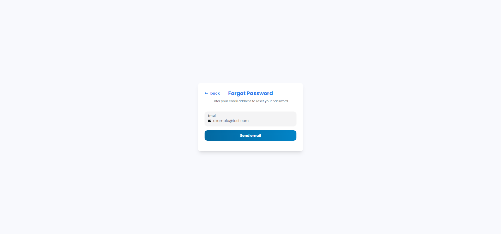
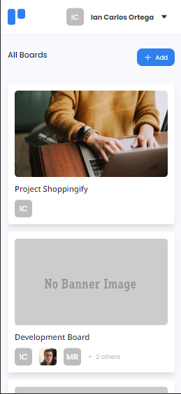

# Thrullo

## Description

Web application for project management, task tracking, and collaboration across a wide range of industries and teams, including software development, marketing, event planning, and personal productivity.

## Tech Stack

- Typescript
- NextJs 13
- TailwindCSS
- Supabase
- NextUI
- Zustand

## User stories

- I can sign up and login with email and password
- I can login with social media accounts
- I can restore my password if I forget it
- I can create multiple projects
- I can list of available boards
- I can add a new board with a cover photo, title and visibility options
- I can see a board with different columns, team members,... according to the design
- I can add a new list
- I can add a new card to the existing list
- I can set the visibility of the board
- I can add a member to the board (user must exist in the system)
- I can change the name of the board by selecting it
- I can change/add the description of the board
- Given I am an admin, I can remove members from the board
- I can move a card from a column to another one by drag and drop
- When a card is selected, I can rename the title by selecting it
- When a card is selected, I can see which column the card belongs to
- When a card is selected, I can see and change the description
- When a card is selected, I can add new attachments and I can download and delete existing attachments
- When a card is selected, I can add a new comment. Given I am the author, I can edit and delete the comment.
- When a card is selected, I can change the card cover image by searching from Unsplash
- When a card is selected, I can add labels with given colors
- I can toggle between light and dark mode
- I can see the app in different screen sizes

## Development environment setup

- Clone the repository
- Install dependencies by running `npm install`
- Copy `.env.template` and rename to `.env.local` file and add the environment variables
- Run `npm run dev` to start the development server

## User to test app

- Visit [Thrullo](https://thrullo.vercel.app/) to use the app
- Use the following credentials to login
  - Email: **test@gmail.com**
  - Password: **$Asdf123**

## Screenshots

### Database

### Auth

### Dashboard

